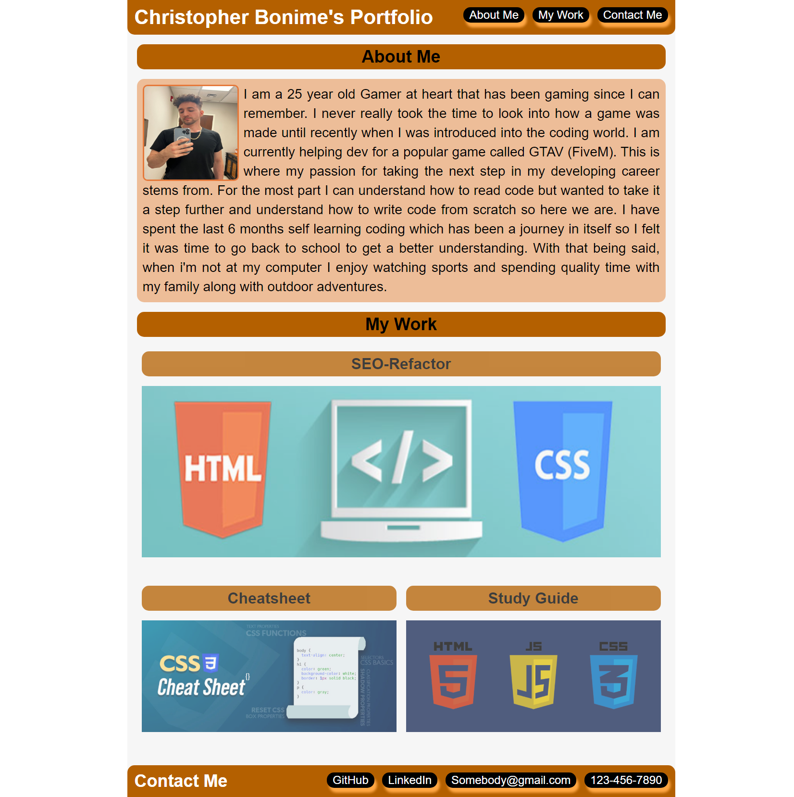

# my-portfolio

[Link to my project](https://github.com/Cujion/my-portfolio)

## Table of Contents
- [Description](#description)
- [Visuals](#visuals)
- [Installation](#installation)
- [License](#license)

## Description
* This is a personally portfolio with some of the HTML and CSS projects I have worked on and give links when you click on the image that will take you to my github where you can view some of my work. This webpage is a good way to display all of my work in one place with easy access to both my work and contact me.

## Visuals

## Installation
* Open the index.html file in a web browser to display the website. To access the code while in the web browser of google chrome right on the page and click inspect and it will open up the chrome dev tools which will allow you to see the html along with the css code for this webpage. 

## License
* MIT License

* Copyright (c) [2022]] [christopher bonime]

* Permission is hereby granted, free of charge, to any person obtaining a copy
of this software and associated documentation files (the "Software"), to deal
in the Software without restriction, including without limitation the rights
to use, copy, modify, merge, publish, distribute, sublicense, and/or sell
copies of the Software, and to permit persons to whom the Software is
furnished to do so, subject to the following conditions:

* The above copyright notice and this permission notice shall be included in all
copies or substantial portions of the Software.

* THE SOFTWARE IS PROVIDED "AS IS", WITHOUT WARRANTY OF ANY KIND, EXPRESS OR
IMPLIED, INCLUDING BUT NOT LIMITED TO THE WARRANTIES OF MERCHANTABILITY,
FITNESS FOR A PARTICULAR PURPOSE AND NONINFRINGEMENT. IN NO EVENT SHALL THE
AUTHORS OR COPYRIGHT HOLDERS BE LIABLE FOR ANY CLAIM, DAMAGES OR OTHER
LIABILITY, WHETHER IN AN ACTION OF CONTRACT, TORT OR OTHERWISE, ARISING FROM,
OUT OF OR IN CONNECTION WITH THE SOFTWARE OR THE USE OR OTHER DEALINGS IN THE
SOFTWARE.
